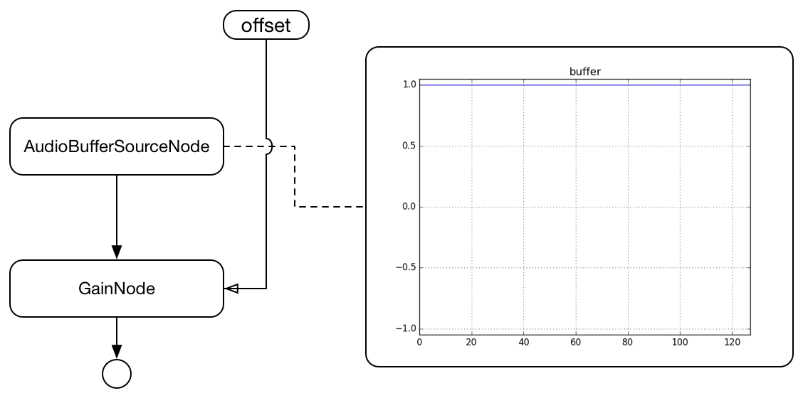

# ConstantSourceNode
[](https://travis-ci.org/mohayonao/constant-source-node)
[](https://www.npmjs.org/package/constant-source-node)
[](https://mohayonao.mit-license.org/)

> ConstantSourceNode for legacy Web Audio API

https://webaudio.github.io/web-audio-api/#ConstantSourceNode

## Installation

```
npm install constant-source-node
```

#### downloads:

- [constant-source-node.js](https://raw.githubusercontent.com/mohayonao/constant-source-node/master/build/constant-source-node.js)
- [constant-source-node.min.js](https://raw.githubusercontent.com/mohayonao/constant-source-node/master/build/constant-source-node.min.js)

## Quick Example

At first, call `polyfill()` method.

```js
require("ConstantSourceNode").polyfill();
```

```html
<script src="/path/to/constant-source-node.js"></script>
<script>ConstantSourceNode.polyfill();</script>
```

Then, you can use `createConstantSource()` method at AudioContext.

```js
var constantSource = audioContext.createConstantSource();

constantSource.offset.value = 10;
```

#### Demo

https://mohayonao.github.io/constant-source-node/

## API
### ConstantSourceNode
  - `constructor(audioContext: AudioContext, opts={})`

#### Class Methods
  - `polyfill(): void`
    - install `createConstantSource()` method to `BaseAudioContext.prototype` if needed.
  - `install(): void`
    - install `createConstantSource()` method to `BaseAudioContext.prototype` force

#### Instance Attributes
  - `offset: AudioParam` _readonly_

## AudioGraph



## License

MIT
